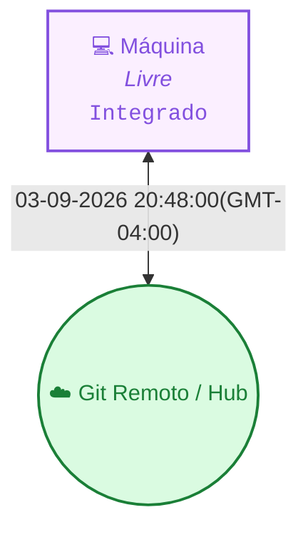

<!-- README.md | Atualizado em: 03-09-2026 20:52:58(GMT-04:00) -->

# 🧠 Painel de Contexto — vitalia-sdd

> **Vitalia Kit v0.5.0 — Ledger de Memória Persistente e Orquestração Multi-Máquina.**  
> Este repositório armazena o histórico distribuído, aprendizados consolidados e o controle de concorrência das sessões de trabalho do framework Vitalia.

---

## 📡 Topologia de Shards & Sincronização

---

## 🖥️ Máquinas e Status Atual

<table>
  <thead>
    <tr>
      <th align="left">Máquina / ID</th>
      <th align="left">Tarefa Atual</th>
      <th align="center">Ambiente</th>
      <th align="center">Status</th>
      <th align="left">Último Sync</th>
      <th align="left">Próximo Passo (P0)</th>
    </tr>
  </thead>
  <tbody>
    <tr>
      <td><strong>unknown</strong> (<code>7f367bd3</code>)</td>
      <td></td>
      <td align="center"></td>
      <td align="center">● Concluído</td>
      <td>03-09-2026 20:48:00(GMT-04:00)</td>
      <td><strong></strong></td>
    </tr>
  </tbody>
</table>

---

## 🎯 Sessão Ativa em Destaque

- **Estação Ativa:** `None` (`7f367bd3`)
- **Tarefa em Execução:** None
- **🎯 Próximo Passo Prioritário (P0):** `None`
- **Última Sincronização:** `03-09-2026 20:48:00(GMT-04:00)`

---

## 📚 Histórico, Decisões & Guard Rails

<strong>🔍 Clique para expandir o Histórico Completo de Sessões</strong>

 

| Data / Hora | Estação (ID) | Tarefa Executada | Próximo Passo (P0) |
| :--- | :--- | :--- | :--- |
| 03-09-2026 20:48:00(GMT-04:00) | `andrenote (7f367bd3)` | Setup do Ambiente e Alinhamento Estratégico Vitalia SDD v0.0.1 | `Sincronizar o repositório de memória na nuvem através do comando /vitalia-session-consolidate` |
| 29-08-2026 11:23:41(GMT-04:00) | `andrenote (7f367bd3)` | Setup do Ambiente e Alinhamento Estratégico Vitalia SDD v0.0.1 | `Adequação dos 4 workflows (session-start, session-consolidate, session-end, vitalia-route) e ajuste do .gitignore` |

<strong>⚖️ Clique para expandir as Decisões Arquiteturais Consolidadas</strong>

 

| Máquina (ID) | Decisão Arquitetural | Impacto / Racional |
| :--- | :--- | :--- |
| `7f367bd3` | **[d32e318c]** `[SCOPE]` Focar a primeira entrega na adequação dos 4 workflows de gestão de contexto (session-start, session-consolidate, session-end, vitalia-route). | Garantir ciclo limpo de sessão antes de expandir outros domínios. |
| `7f367bd3` | **[1d0f3cdd]** `[ARCH]` Manter o /vitalia-brainstorming inalterado durante a transição inicial. | O brainstorming está em evolução deliberada para atuar como Hub Socrático Orquestrador do Ecossistema Multiagentes. |

<strong>🛡️ Clique para expandir os Guard Rails de Grounding e Domínios</strong>

 

| Arquivo de Regras | Status | Domínios Monitorados | Pendentes de Curadoria HITL |
| :--- | :---: | :--- | :---: |
| `grounding-domains.yaml` (Global) | ✅ Ativo | `llm_models`, `python_packages`, `external_apis`, `security_practices`, `regulations`, `cloud_services`, `scientific_claims` | — |
| `grounding-domains-local.yaml` (Projeto) | ✅ Sincronizado | Domínios locais específicos do workspace | `0 pendências` |

---

Painel gerado automaticamente pelo motor de contexto do Vitalia Kit (<code>vitalia_context_engine.py --action consolidate</code>).
