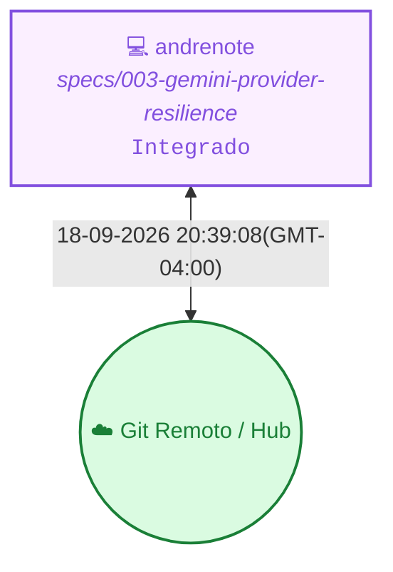

<!-- README.md | Atualizado em: 18-09-2026 20:40:12(GMT-04:00) -->

# 🧠 Painel de Contexto — vitalia-sdd

> **Vitalia Kit v0.5.0 — Ledger de Memória Persistente e Orquestração Multi-Máquina.**  
> Este repositório armazena o histórico distribuído, aprendizados consolidados e o controle de concorrência das sessões de trabalho do framework Vitalia.

---

## 📡 Topologia de Shards & Sincronização

---

## 🖥️ Máquinas e Status Atual

<table>
  <thead>
    <tr>
      <th align="left">Máquina / ID</th>
      <th align="left">Tarefa Atual</th>
      <th align="center">Ambiente</th>
      <th align="center">Status</th>
      <th align="left">Último Sync</th>
      <th align="left">Próximo Passo (P0)</th>
    </tr>
  </thead>
  <tbody>
    <tr>
      <td><strong>andrenote</strong> (<code>7f367bd3</code>)</td>
      <td>specs/003-gemini-provider-resilience</td>
      <td align="center"></td>
      <td align="center">● Concluído</td>
      <td>18-09-2026 20:39:08(GMT-04:00)</td>
      <td><strong>Execução do /vitalia-release para a feature specs/003-gemini-provider-resilience ou início do próximo ciclo SDD.</strong></td>
    </tr>
  </tbody>
</table>

---

## 🎯 Sessão Ativa em Destaque

- **Estação Ativa:** `andrenote` (`7f367bd3`)
- **Tarefa em Execução:** specs/003-gemini-provider-resilience
- **🎯 Próximo Passo Prioritário (P0):** `Execução do /vitalia-release para a feature specs/003-gemini-provider-resilience ou início do próximo ciclo SDD.`
- **Última Sincronização:** `18-09-2026 20:39:08(GMT-04:00)`

---

## 📚 Histórico, Decisões & Guard Rails

<strong>🔍 Clique para expandir o Histórico Completo de Sessões</strong>

 

| Data / Hora | Estação (ID) | Tarefa Executada | Próximo Passo (P0) |
| :--- | :--- | :--- | :--- |
| 18-09-2026 20:39:08(GMT-04:00) | `andrenote (7f367bd3)` | specs/003-gemini-provider-resilience | `Execução do /vitalia-release para a feature specs/003-gemini-provider-resilience ou início do próximo ciclo SDD.` |
| 17-09-2026 16:46:41(GMT-04:00) | `andrenote (7f367bd3)` | specs/003-gemini-provider-resilience | `Análise da documentação recém-criada (docs/vitalia-sdd-architecture-guide.md, docs/onboarding-dev-guide.md e docs/research-gemini-resilience.md) e execução do /vitalia-spec-specify para a feature specs/003-gemini-provider-resilience.` |
| 17-09-2026 14:01:08(GMT-04:00) | `andrenote (7f367bd3)` | specs/002-fragment-sdd-judge | `Realizar a consolidação de memórias e contexto via /vitalia-session-consolidate.` |
| 16-09-2026 20:01:34(GMT-04:00) | `andrenote (7f367bd3)` | specs/001-refactor-clarify-converge | `Executar o script de bootstrap install-project.sh para vincular formalmente a versão v0.6.0 do kit-global em ~/.vitalia/ e iniciar novo ciclo de desenvolvimento.` |
| 14-09-2026 21:05:30(GMT-04:00) | `andrenote (7f367bd3)` | Vitalia SDD v0.6.0 — Validação Fases 1-3 | `Iniciar a Fase 4 do Plano de Refatoração (Fragmentação Modular dos Monolitos)` |
| 08-09-2026 20:09:41(GMT-04:00) | `andrenote (7f367bd3)` | Vitalia SDD v0.6.0 | `Aguardando definição na próxima sessão` |
| 08-09-2026 17:46:15(GMT-04:00) | `andrenote (7f367bd3)` | Vitalia SDD v0.6.0 | `Executar o comando `/vitalia-session-consolidate` para ativar o motor Python, gerar o novo painel `README.md` curado com nossos dados locais e sincronizar com o repositório na nuvem.` |
| 07-09-2026 23:30:11(GMT-04:00) | `andrenote (7f367bd3)` | Context Lifting e Session Fallback | `Executar a refatoração do vitalia_hook_runner.py conforme o plano de implementação aprovado.` |
| 07-09-2026 21:34:49(GMT-04:00) | `andrenote (7f367bd3)` | Adequação do kit-global e análise de contexto | `(Pendente de definição pelo usuário)` |
| 07-09-2026 18:58:42(GMT-04:00) | `andrenote (7f367bd3)` | Infraestrutura dos EUA | `Adicionar agents_catalog.yaml e refatorar view_renderer.py para geração de VIEW read-only de grounding_domains` |

<strong>⚖️ Clique para expandir as Decisões Arquiteturais Consolidadas</strong>

 

| Máquina (ID) | Decisão Arquitetural | Impacto / Racional |
| :--- | :--- | :--- |
| `7f367bd3` | **[9a527fd9]** `ARQUITETURA` Adoção de parser de retryDelay, Full Jitter Backoff e Telemetria Transacional agregada por dia para a API Gemini | Previne estouro de quota em chamadas concorrentes dos hooks, reduz tempo de espera parsing retryDelay e sanitiza telemetria cumprindo P04 e P07 |
| `7f367bd3` | **[fc8455b6]** `ARQUITETURA` Adoção do modelo gemini-3.6-flash, Full Jitter e Telemetria Transacional em tmp/gemini_transactions.jsonl | Garante alta resiliência contra estresses de API (429/503), telemetria exata de consumo de tokens por sessão e failover para Ollama local sem travamentos. |
| `7f367bd3` | **[d8eb2682]** `ARQUITETURA` Adoção de Exponential Backoff no GeminiRESTProvider para tratar erros HTTP 429 e HTTP 503 | Provedores de Nuvem REST em sub-agentes e hooks necessitam de retries exponenciais progressivos (3s, 6s, 12s, 24s, 48s) e 90s de timeout HTTP para absorver variações de carga e cota sem inviabilizar o pipeline. |
| `7f367bd3` | **[a65227df]** `ARQUITETURA` Adoção da API REST do Google Gemini (gemini-3.5-flash | temp=0.2) via leitor dinâmico no .env (P11) como provedor principal do sdd_judge.py. | Garante alta velocidade de auditoria (< 3s), sem hardcoding de modelo, com resiliência por retry e fallback local para Ollama. |
| `7f367bd3` | **[f8df0af0]** `ARQUITETURA` Execução de Smoke Tests nos pontos de entrada nativos após reinstalação do Kit | Assegura que o parser de --args e as chamadas sdd_judge.py estão operacionais antes de avançar para a Fase 4. |
| `7f367bd3` | **[564628ec]** `[ARCH]` Criação do grounding_domain_schema.json e injeção (reads) no pipeline de finalização. | Estabelece um contrato formal de interoperabilidade que evita comandos shell malformados ou sobrescrita global de config de saúde/domínio. |
| `7f367bd3` | **[996ac4fb]** `[ARCH]` Manter o modelo como consumidor passivo de Markdown gerado, abdicando da consolidação LLM-only. | A nova arquitetura 0.6 delega toda a consolidação ao motor Python. O LLM atua apenas como iterador de UI e coletor de schemas rígidos (session-end). |
| `7f367bd3` | **[a752df1a]** `ARQUITETURA` profiles/ como pasta única para todas as fontes YAML — schema_type diferencia o tipo | Um único diretório para grep, auditoria e versionamento. Guardian detecta adaptador via schema_type, não pelo path. |
| `7f367bd3` | **[85a6137b]** `ARQUITETURA` Q4 Guardian fallback: Opção B agora (fix path) + Opção C em v0.7.0 (remover fallback) | Fix cirúrgico de 1 linha — mínimo risco de regressão. Elimina dívida técnica na próxima versão. |
| `7f367bd3` | **[d75f2168]** `ARQUITETURA` constitution.yaml usa Dual-Index (domain_index + principles) — formato O(1) para lookup | GuardianContextV2 detecta 'domain_index' no YAML e seleciona ConstitutionAdapterV2 automaticamente. |

<strong>🛡️ Clique para expandir os Guard Rails de Grounding e Domínios</strong>

 

| Arquivo de Regras | Status | Domínios Monitorados | Pendentes de Curadoria HITL |
| :--- | :---: | :--- | :---: |
| `grounding-domains.yaml` (Global) | ✅ Ativo | `llm_models`, `python_packages`, `external_apis`, `security_practices`, `regulations`, `cloud_services`, `scientific_claims` | — |
| `grounding-domains-local.yaml` (Projeto) | ✅ Sincronizado | Domínios locais específicos do workspace | `0 pendências` |

---

Painel gerado automaticamente pelo motor de contexto do Vitalia Kit (<code>vitalia_context_engine.py --action consolidate</code>).
