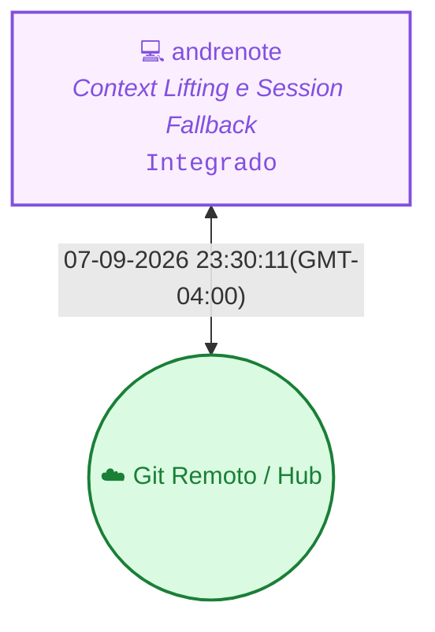

<!-- README.md | Atualizado em: 07-09-2026 23:31:11(GMT-04:00) -->

# 🧠 Painel de Contexto — vitalia-sdd

> **Vitalia Kit v0.5.0 — Ledger de Memória Persistente e Orquestração Multi-Máquina.**  
> Este repositório armazena o histórico distribuído, aprendizados consolidados e o controle de concorrência das sessões de trabalho do framework Vitalia.

---

## 📡 Topologia de Shards & Sincronização

---

## 🖥️ Máquinas e Status Atual

<table>
  <thead>
    <tr>
      <th align="left">Máquina / ID</th>
      <th align="left">Tarefa Atual</th>
      <th align="center">Ambiente</th>
      <th align="center">Status</th>
      <th align="left">Último Sync</th>
      <th align="left">Próximo Passo (P0)</th>
    </tr>
  </thead>
  <tbody>
    <tr>
      <td><strong>andrenote</strong> (<code>7f367bd3</code>)</td>
      <td>Context Lifting e Session Fallback</td>
      <td align="center"></td>
      <td align="center">● Concluído</td>
      <td>07-09-2026 23:30:11(GMT-04:00)</td>
      <td><strong>Executar a refatoração do vitalia_hook_runner.py conforme o plano de implementação aprovado.</strong></td>
    </tr>
  </tbody>
</table>

---

## 🎯 Sessão Ativa em Destaque

- **Estação Ativa:** `andrenote` (`7f367bd3`)
- **Tarefa em Execução:** Context Lifting e Session Fallback
- **🎯 Próximo Passo Prioritário (P0):** `Executar a refatoração do vitalia_hook_runner.py conforme o plano de implementação aprovado.`
- **Última Sincronização:** `07-09-2026 23:30:11(GMT-04:00)`

---

## 📚 Histórico, Decisões & Guard Rails

<strong>🔍 Clique para expandir o Histórico Completo de Sessões</strong>

 

| Data / Hora | Estação (ID) | Tarefa Executada | Próximo Passo (P0) |
| :--- | :--- | :--- | :--- |
| 07-09-2026 23:30:11(GMT-04:00) | `andrenote (7f367bd3)` | Context Lifting e Session Fallback | `Executar a refatoração do vitalia_hook_runner.py conforme o plano de implementação aprovado.` |
| 07-09-2026 21:34:49(GMT-04:00) | `andrenote (7f367bd3)` | Adequação do kit-global e análise de contexto | `(Pendente de definição pelo usuário)` |
| 07-09-2026 18:58:42(GMT-04:00) | `andrenote (7f367bd3)` | Infraestrutura dos EUA | `Adicionar agents_catalog.yaml e refatorar view_renderer.py para geração de VIEW read-only de grounding_domains` |
| 06-09-2026 11:56:55(GMT-04:00) | `andrenote (7f367bd3)` | Evolução Context Engine (JSON Schemas) | `Iniciar Tarefas T001-T008` |
| 06-09-2026 09:09:05(GMT-04:00) | `andrenote (7f367bd3)` | Diagnóstico e Refatoração de Schemas do Motor de Contexto | `Sincronizar o repositório de memória na nuvem através do comando /vitalia-session-consolidate` |
| 06-09-2026 08:42:22(GMT-04:00) | `andrenote (7f367bd3)` | Diagnóstico e Refatoração de Schemas do Motor de Contexto | `Sincronizar o repositório de memória na nuvem através do comando /vitalia-session-consolidate` |
| 03-09-2026 20:48:00(GMT-04:00) | `andrenote (7f367bd3)` | Setup do Ambiente e Alinhamento Estratégico Vitalia SDD v0.0.1 | `Sincronizar o repositório de memória na nuvem através do comando /vitalia-session-consolidate` |
| 29-08-2026 11:23:41(GMT-04:00) | `andrenote (7f367bd3)` | Setup do Ambiente e Alinhamento Estratégico Vitalia SDD v0.0.1 | `Adequação dos 4 workflows (session-start, session-consolidate, session-end, vitalia-route) e ajuste do .gitignore` |

<strong>⚖️ Clique para expandir as Decisões Arquiteturais Consolidadas</strong>

 

| Máquina (ID) | Decisão Arquitetural | Impacto / Racional |
| :--- | :--- | :--- |
| `7f367bd3` | **[a752df1a]** `ARQUITETURA` profiles/ como pasta única para todas as fontes YAML — schema_type diferencia o tipo | Um único diretório para grep, auditoria e versionamento. Guardian detecta adaptador via schema_type, não pelo path. |
| `7f367bd3` | **[85a6137b]** `ARQUITETURA` Q4 Guardian fallback: Opção B agora (fix path) + Opção C em v0.7.0 (remover fallback) | Fix cirúrgico de 1 linha — mínimo risco de regressão. Elimina dívida técnica na próxima versão. |
| `7f367bd3` | **[d75f2168]** `ARQUITETURA` constitution.yaml usa Dual-Index (domain_index + principles) — formato O(1) para lookup | GuardianContextV2 detecta 'domain_index' no YAML e seleciona ConstitutionAdapterV2 automaticamente. |
| `7f367bd3` | **[b98a0db7]** `[ARCH]` Armazenar JSON schemas canônicos em kit-global/src/schemas/. | Centraliza os artefatos de definição de tipo junto aos pacotes fonte (src) que os processam. |
| `7f367bd3` | **[87d16a5b]** `[ARCH]` Validar schemas estritos via jsonschema em context_engine.py antes da escrita. | Evita corrupção da memória local, bloqueando o persistir de payloads mal-formados gerados por agentes. |
| `7f367bd3` | **[d32e318c]** `[SCOPE]` Focar a primeira entrega na adequação dos 4 workflows de gestão de contexto (session-start, session-consolidate, session-end, vitalia-route). | Garantir ciclo limpo de sessão antes de expandir outros domínios. |
| `7f367bd3` | **[1d0f3cdd]** `[ARCH]` Manter o /vitalia-brainstorming inalterado durante a transição inicial. | O brainstorming está em evolução deliberada para atuar como Hub Socrático Orquestrador do Ecossistema Multiagentes. |

<strong>🛡️ Clique para expandir os Guard Rails de Grounding e Domínios</strong>

 

| Arquivo de Regras | Status | Domínios Monitorados | Pendentes de Curadoria HITL |
| :--- | :---: | :--- | :---: |
| `grounding-domains.yaml` (Global) | ✅ Ativo | `llm_models`, `python_packages`, `external_apis`, `security_practices`, `regulations`, `cloud_services`, `scientific_claims` | — |
| `grounding-domains-local.yaml` (Projeto) | ✅ Sincronizado | Domínios locais específicos do workspace | `0 pendências` |

---

Painel gerado automaticamente pelo motor de contexto do Vitalia Kit (<code>vitalia_context_engine.py --action consolidate</code>).
